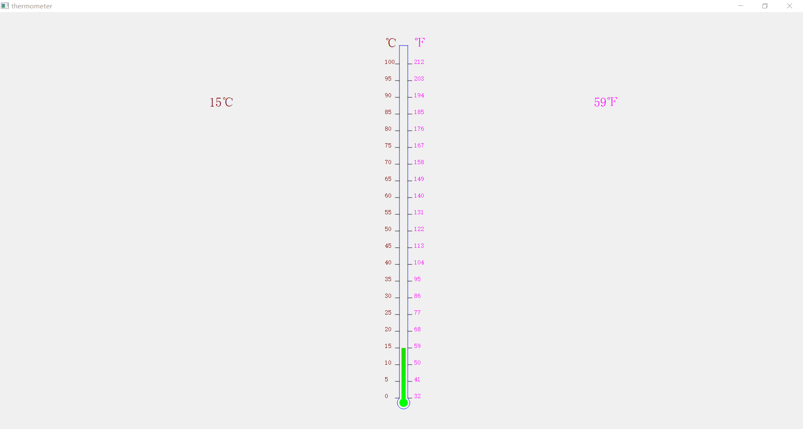
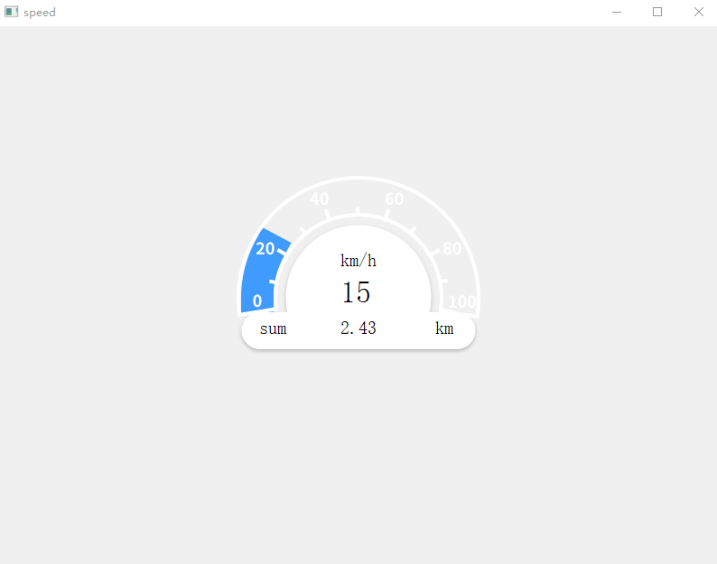

# qt-scada
Qt5 scada controls for industrial HMI usage.

支持的组态控件清单

- temperature：温度计、热电偶
- speed：速度仪表盘
- tank：水箱、水位
- reactor：反应炉
- pump：泵，干泵、冷泵、分子泵
- motor：电机
- vacuummeter：真空计
- valve：阀门
- pipe：管道
- robotic arm：机器臂
- shelf：架子

## temperature

## speed

## tank
